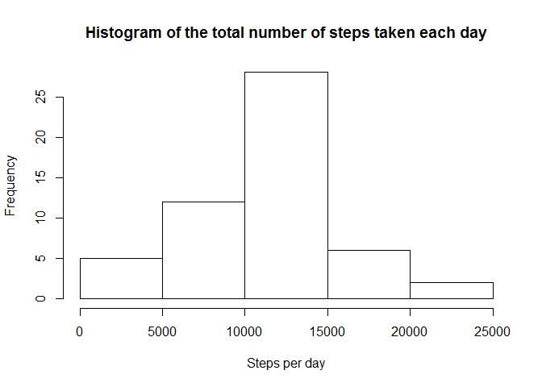
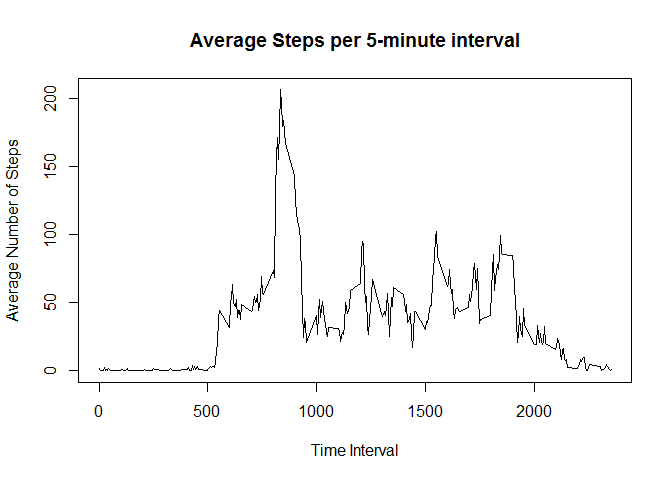

# Reproducible Research: Peer Assessment 1

```r
library(knitr) 
##opts_chunk$set(echo=FALSE)
```
## Loading and preprocessing the data


```r
library(dplyr)
```

```
## 
## Attaching package: 'dplyr'
## 
## The following object is masked from 'package:stats':
## 
##     filter
## 
## The following objects are masked from 'package:base':
## 
##     intersect, setdiff, setequal, union
```

```r
library(lattice)

fileUrl<-"http://d396qusza40orc.cloudfront.net/repdata%2Fdata%2Factivity.zip"


if (!file.exists("activity.csv")){
    download.file(fileUrl, destfile="activity.zip", mode = "wb")
    dateDownloaded <- date()
    dlMessage <- paste("Activity monitoring data successfully downloaded:", dateDownloaded)
    print(dlMessage)
    unzip ("activity.zip")
}

activity <- read.csv("activity.csv", header=TRUE,
                       colClasses=c( "numeric", "character", "numeric"), sep =",", na="NA")

activity[,2]<-as.Date(activity[,2])

cc_steps<-activity[complete.cases(activity[,1]),]

unique_days<-unique(cc_steps[,2])
number_of_days<-length(unique_days)

steps_per_day<-data.frame()
```

## What is mean total number of steps taken per day?

```r
for (i in 1:number_of_days) {
    day<-unique_days[i]
    steps_per_day[i,1]<-as.character(day)
    steps_in_a_day<-filter(cc_steps, cc_steps$date==day)
    steps_per_day[i,2]<-sum(steps_in_a_day[,1], na.rm=TRUE)
}

hist(steps_per_day[,2])
```

 

```r
mean_steps<-mean(steps_per_day[,2])
print(mean_steps)
```

```
## [1] 10766.19
```

```r
median_steps<-median(steps_per_day[,2])
print(median_steps)
```

```
## [1] 10765
```


## What is the average daily activity pattern?

```r
steps_by_time<-data.frame()

unq_times<-unique(activity[,3])
num_of_times<-length(unq_times)
for (i in 1:num_of_times) {
    time<-unq_times[i]
    steps_by_time[i,1]<-time
    steps_in_an_interval <- filter(cc_steps, cc_steps$interval==time)
    steps_by_time[i,2]<-sum(steps_in_an_interval[,1], na.rm=TRUE)
    steps_by_time[i,3]<-length(steps_in_an_interval[,1])
}
colnames(steps_by_time)<-c("Interval", "Total.Steps", "Complete.Cases")

with(steps_by_time, plot(Interval, Total.Steps, xlab = "", type = "l", pch=NA))
```

 

```r
max_val<-which.max(steps_by_time[,2])
interval_message<-paste("Highest number of steps are in the", steps_by_time[max_val,1], "interval")
print(interval_message)
```

```
## [1] "Highest number of steps are in the 835 interval"
```


## Imputing missing values

```r
missing_vals <- is.na(activity[,1])
num_of_missing_vals<-sum(missing_vals)
val_message <- paste("Number of missing values:", num_of_missing_vals)
print(val_message)
```

```
## [1] "Number of missing values: 2304"
```

```r
rows_to_replace <- activity[missing_vals,]

for (i in 1:num_of_missing_vals){
    bad_row<-rows_to_replace[i,]
    val_to_match<-bad_row[1,3]

    row_to_calc<-steps_by_time[which(steps_by_time$Interval == val_to_match), ]
    
    new_val<-round(row_to_calc$Total.Steps/row_to_calc$Complete.Cases,
                   digits = 0)
    rows_to_replace[i,1]<-new_val
    
}

filled_table<-activity
filled_table[missing_vals,]<-rows_to_replace

steps_per_day_filled<-data.frame()
unique_days<-unique(filled_table[,2])
number_of_days<-length(unique_days)

for (i in 1:number_of_days) {
    day<-unique_days[i]
    steps_per_day_filled[i,1]<-as.character(day)
    steps_in_a_day_filled<-filter(filled_table, filled_table$date==day)
    steps_per_day_filled[i,2]<-sum(steps_in_a_day_filled[,1])
    
}

hist(steps_per_day_filled[,2])
```

 

```r
mean_steps_filled<-round(mean(steps_per_day_filled[,2]), digits=0)
filled_mean_message<-paste("Mean steps (filled):", mean_steps_filled)
print(filled_mean_message)
```

```
## [1] "Mean steps (filled): 10766"
```

```r
median_steps_filled<-median(steps_per_day_filled[,2])
filled_median_message<-paste("Median steps (filled):", median_steps_filled)
print(filled_median_message)
```

```
## [1] "Median steps (filled): 10762"
```


## Are there differences in activity patterns between weekdays and weekends?

```r
for (h in 1:number_of_days)    {
    day_of_week<-weekdays(unique_days[h])
    
    if (day_of_week=="Saturday"||day_of_week=="Sunday"){
        end_or_day <- "Weekend"
    }
    else {
        end_or_day <- "Weekday"
    }
    
    first_obv <- ((h-1)*288)+1
    last_obv <-(h*288)
    
    filled_table[first_obv:last_obv, 4]<-end_or_day
    
}
colnames(filled_table)[4]<-c("Weekend.or.day")
filled_table<-transform(filled_table, Weekend.or.day = factor(Weekend.or.day))


days<-filter(filled_table, Weekend.or.day=="Weekday")

weekday_means<-tapply(days$steps, days$interval, mean)
weekday_means_df<-data.frame(weekday_means)
weekday_means_df[,2]<-as.numeric(rownames(weekday_means_df))
weekday_means_df[,3]<-"Weekday"
colnames(weekday_means_df)<-c("mean_of_wdays", "interval", "Weekend.or.day")

ends<-filter(filled_table, Weekend.or.day=="Weekend")
weekend_means<-tapply(ends$steps, ends$interval, mean)
weekend_means_df<-data.frame(weekend_means)
weekend_means_df[,2]<-as.numeric(rownames(weekend_means_df))
weekend_means_df[,3]<-"Weekend"
colnames(weekend_means_df)<-c("mean_of_wdays", "interval", "Weekend.or.day")

means_df<-rbind(weekday_means_df, weekend_means_df)

p<-xyplot(mean_of_wdays ~ interval |Weekend.or.day, data=means_df, type="l", layout = c(1,2))
print(p)
```

 

